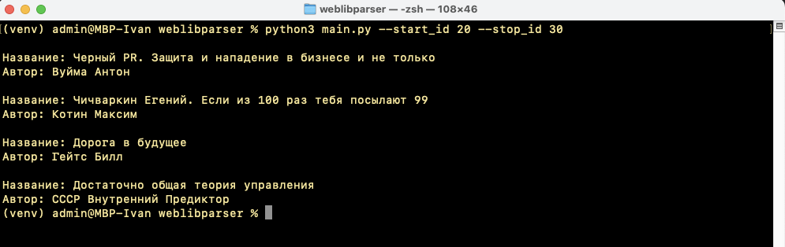

# On-line library `tululu.org` parser

## Description

Script parses books texts and images from on-line library: https://tululu.org/ and puts it to the local folders.

## Prepare virtual environment

First, install package `python3-venv` to work with python virtual environment.

Update packages on your system `!(it depends on your operating system)`
in this document I use Ubuntu as my operating system. 

So I run update command:

```console
$ sudo apt update
```

and run command:

```console
$ sudo apt install -y python3-venv
```

Then jump to project folder:

```console
$ cd weblibparser
```

and create new python environment to run the code:
```console
$ python3 -m venv venv
```

Activate new virtual environment:

```console
$ source venv/bin/activate
```

As a result, you will see command line prompt like this:

```console
(venv) weblibparser $
```

Next step, install all necessary dependencies

```console
(venv) weblibparser $  pip3 install -r requirements.txt
```


## Prepare .env file

This script read environment variables from external file `.env`

These variables are:

- BOOK_TXT_FOLDER  (local folder to save books as a TXT files)
- BOOK_IMAGE_FOLDER (local folder to save books images as graphic files)
- DELAY_INTERVAL (time delay before next network operation in case of collision)

Setup these options in accordance with your purposes and objectives.

In case of `.env` file absence, script will parse on-line library with default parameters to save books and images to the computer.

Default parameters to parse on-line library are:

- BOOK_TXT_FOLDER = 'books/'
- BOOK_IMAGE_FOLDER = 'images/'
- DELAY_INTERVAL = 5

# Run script

To run on-line library parsing, you can just execute command:

```console
(venv) weblibparser $  python3 main.py
```

In this way, script will parse books with id from 1 to 10.

You can setup book range for scanning, running script with options:
- --start_id
- --stop_id  


```console
(venv) weblibparser $  python3 main.py --start_id 20 --stop_id 30      
```

Be careful with script parameters: `--stop_id` must be larger then `start_id`.

Script catch incorrect input parameters and throw error message in case of collision.

After success parsing, you will see picture like this:




# Result log file

Script writes log file `parser.log` with errors and collisions events. It allows you to figure out and fix occurred issues. 

# Projects goals

This site was written as a study project for Python web development course [Devman](https://dvmn.org)
